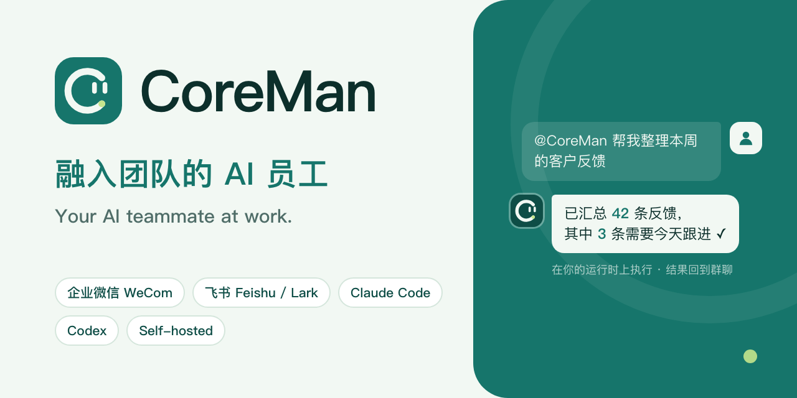
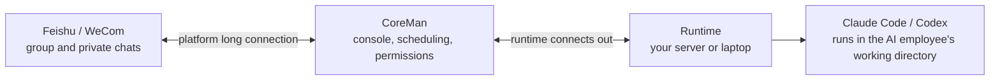
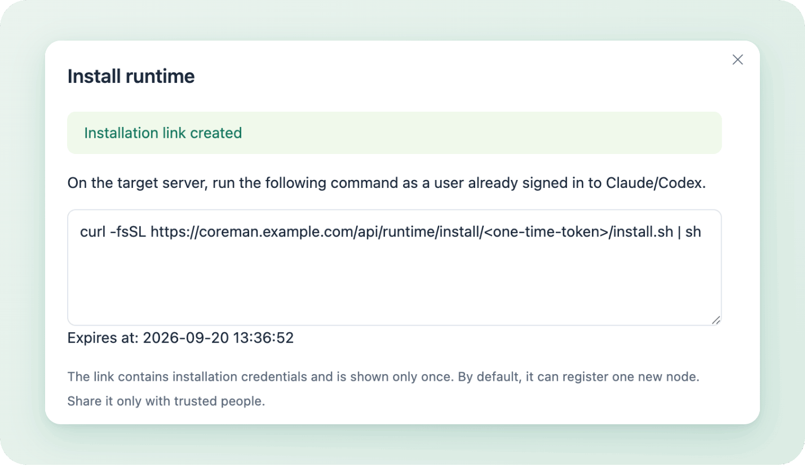
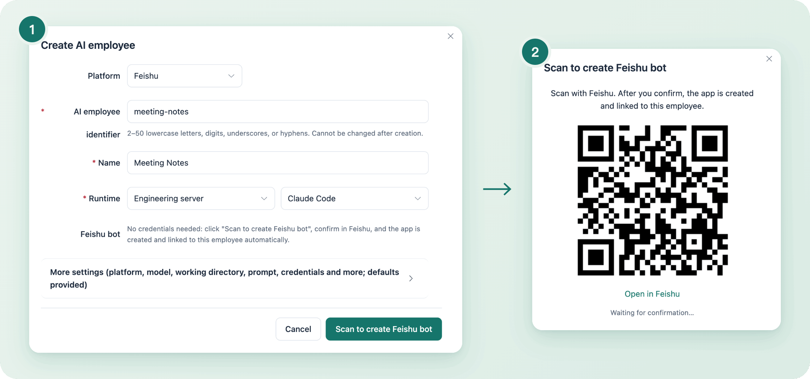
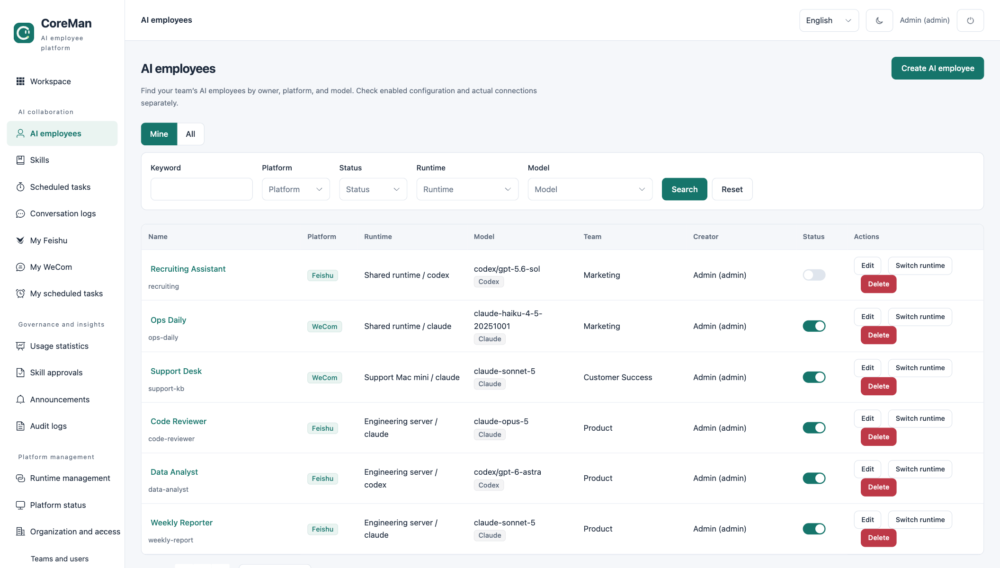
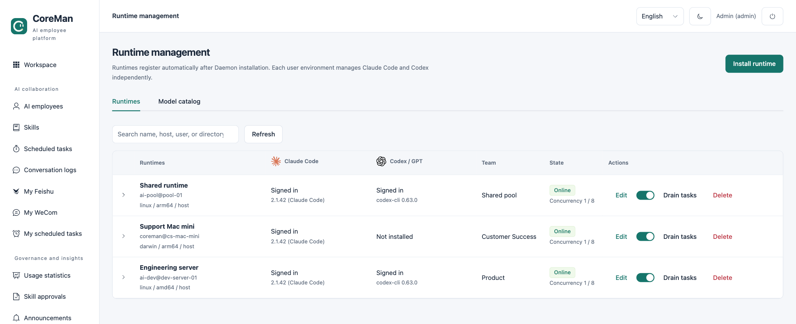

<p align="center"></p>

<p align="center">
  <a href="https://github.com/wxkingstar/CoreMan/actions/workflows/ci.yml"></a>
  <a href="https://github.com/wxkingstar/CoreMan/releases"></a>
  <a href="LICENSE"></a>
</p>

<p align="center"><a href="README.md">中文</a> · English</p>

# CoreMan

**Turn Claude Code and Codex into AI employees your team can reach in Feishu (Lark) and WeCom.**

Mention one in a group chat or message it directly, and it runs Claude Code or Codex on your own machines and posts the result back to the chat. Administrators manage every AI employee from one console: which model it uses, which machine it runs on, which skills it has and who may use it.

- **Scan a QR code, get a bot**: when you create an AI employee, scan with Feishu or WeCom and the bot is created for you, with no app setup in the developer console. Chat runs over the platforms' long connections, so you need no public IP or callback domain.
- **Runs in your environment**: CoreMan is self-hosted. The AI runs on machines you choose, as the system user you choose, and its working files stay there.
- **Built for teams**: teams and roles, skill approval, scheduled tasks, conversation logs, usage statistics and audit logs out of the box.

> [!NOTE]
> CoreMan does not provide model quota. Install and sign in to Claude Code or Codex yourself, with your own subscription or API account.

## What it does

- **Shares the work in group chats**: "@Weekly Reporter summarize the requirements we discussed this week". Replies stream in with a collapsible thinking panel, and images, files and quoted messages work.
- **Acts as a personal assistant**: after you send "连接飞书" (Connect Feishu) or "连接企业微信" (Connect WeCom) in a private chat and pick a scope (for WeCom, scan once on the console's "My WeCom" page first), it can read and act on your own messages, calendar, mail, tasks, documents, approvals and more, for example checking your schedule, booking a meeting or sending mail (sending needs the top tier and your explicit request). These tools are only used in your private chat with it.
- **Works on a schedule**: say "every weekday at 9, summarize my unread Feishu messages" in a private chat and confirm the card to create a scheduled task. Administrators can also schedule tasks that deliver results to group chats, private chats or email.
- **Asks a human when unsure**: human escalation sends a question to a named colleague, and the AI continues once they reply.
- **Keeps capabilities in one place**: sync skills from Git plugin marketplaces and install them on AI employees after approval. When the AI calls internal business systems, it does so with the identity of the person who asked.

## How it works



- **CoreMan** is the management service, deployed with Docker Compose. It handles chat messages, queuing, permissions and storage.
- **Runtime** is a daemon installed in a Linux or macOS user environment. It connects out to CoreMan, so its machine needs no inbound ports. One runtime serves both Claude Code and Codex, whichever that user has signed in to.
- **An AI employee** combines a Feishu or WeCom bot, a runtime, a model, a working directory, a prompt and skills.

See the [architecture overview](docs/architecture.md) for how the services fit together and the [glossary](docs/glossary.md) for the English term of each concept. Most other documentation is in Chinese.

## Quick start

You can run everything below on a single computer.

**You need:**

- A computer or server with Git, Python 3 and Docker (with Compose v2) to run CoreMan.
- A Linux or macOS user environment with Claude Code or Codex installed and signed in, to run the runtime. For a trial, this can be the same computer.
- A Feishu or WeCom account to scan the QR code that creates the bot.

### 1. Start CoreMan

```bash
git clone https://github.com/wxkingstar/CoreMan.git
cd CoreMan
cp .env.example .env
./deploy/coreman build
./deploy/coreman up
```

The first build downloads container images plus Python, Node.js and Go dependencies, so it takes a while depending on your network. `up` generates the encryption keys, the database password and the administrator password and writes them back to `.env`. Keep a backup of that file.

Open <http://localhost/> and sign in as `admin`. To see the password:

```bash
grep BOOTSTRAP_ADMIN_PASSWORD .env
```

If port 80 is taken, set `CADDY_HTTP_PORT=8080`, `CADDY_HTTPS_PORT=8443` and `PUBLIC_BASE_URL=http://localhost:8080` in `.env`, then run `./deploy/coreman up` again.

### 2. Connect a runtime

Under "Runtime management", click "Install runtime", enter a project root directory (AI employees' working directories are created under it) and generate the install command. Run it in the user environment where Claude Code or Codex is signed in. Once it finishes, the machine appears in the list with the sign-in status of Claude Code and Codex.

<p align="center"></p>

Linux needs user-level systemd, and Debian or Ubuntu also need `python3-venv`. See the [runtime installation guide](runtime_daemon/README.md) for the full requirements.

### 3. Create an AI employee

Under "AI employees", click "Create AI employee", enter an identifier and a name, pick the runtime you just connected and click "Scan to create Feishu bot". Confirm in Feishu and the Feishu bot and the AI employee are created together. Scan-to-create does not support international Lark tenants yet.

<p align="center"></p>

For WeCom, switch the platform to WeCom and click "Scan to create WeCom bot". WeCom creates such bots for personal use only, so switch the bot to multi-user in the WeCom desktop client before colleagues can message it. To use an existing bot, enter its credentials under "More settings". Platform-side preparation and limits are described in [Feishu setup](docs/feishu.md) and [WeCom setup](docs/wecom.md).

### 4. Chat with it

Find the bot in Feishu or WeCom and message it, or add it to a group and mention it. Every turn shows up under "Conversation logs", and "Platform status" shows connections and task queues. If you get no reply, check those two pages first, then the setup guides above.

## The console

All AI employees live in one list that you can filter by platform, runtime, model and team:



Runtime management shows whether Claude Code and Codex are signed in and online on each machine:



The console is available in Chinese, Japanese and English.

## Features

- **Chat**: long-connection messaging for Feishu and WeCom, streaming replies with a thinking panel, images, files, quoted messages, interactive question cards and Feishu slash commands (`/new`, `/stop` and more).
- **AI employees**: scan-to-create bots, prompts, models, working directories, collaborators, usage allowlists and team ownership, and switching runtimes with workspace and memory migration. Feishu app permissions, menus, availability and releases can be managed from the console too.
- **Personal authorization**: members connect Feishu or WeCom in a private chat and grant access to their own data by tier (for WeCom, after binding once on the "My WeCom" page). It is used only in that member's private chats and their own scheduled tasks, and only they can view those conversations.
- **Tasks and collaboration**: scheduled tasks (delivered to private chats, group chats, email or WeCom group robots), AI scheduled tasks that members create themselves, human escalation, session management and collaboration between Feishu AI employees.
- **Skills and business systems**: skill catalog with installation approval, environment presets and memory sync; short-lived tokens issued per speaker for internal business systems.
- **Teams and governance**: teams, roles, directory sync and platform sign-in, encrypted credentials, usage and cost statistics, AI employee health reports, audit logs and announcements.
- **Self-hosted operations**: Docker Compose deployment, database migrations, drain-based gateway upgrades and rollback, optional S3 attachment storage, Prometheus metrics and alerts.

## Running in production

- **Domain and HTTPS**: set `CADDY_SITE_ADDRESS` in `.env` to your domain (for example `coreman.example.com`) and `PUBLIC_BASE_URL` to the matching `https://` address; Caddy obtains the certificate. Browsers and every runtime must be able to reach that address.
- **Platform sign-in and directory**: create teams under "Teams and users" and configure directory sync and sign-in under "Platform apps". Once platform sign-in works, turn off bootstrap administrator sign-in under "Settings".
- **Execution boundary**: the AI CLI acts with the permissions of the system user that runs the runtime. Give each runtime a dedicated, least-privilege system user and isolate files and network access as needed; prompt constraints are no substitute for operating-system isolation. See the [security policy](SECURITY.md) for the trust model.
- **Upgrades and backups**: build a new version with `./deploy/coreman build` and roll it out with `./deploy/coreman upgrade all <tag>`, see [operations](docs/operations.md) (in Chinese). Back up `.env` and the database regularly; without `MASTER_KEY`, the credentials encrypted in the database cannot be decrypted.

CoreMan is at an early stage (latest release 0.2.0) and `main` keeps gaining features; see the [CHANGELOG](CHANGELOG.md).

## Documentation

Documents are in Chinese unless marked otherwise.

- Concepts and structure: [Glossary](docs/glossary.md) · [Architecture and service topology](docs/architecture.md#service-topology) (English)
- Integrations and features: [Feishu](docs/feishu.md) · [WeCom](docs/wecom.md) · [Skills and approval](docs/skills-management.md) · [Memory](docs/memories.md) · [Scheduled tasks](docs/cron-jobs.md) · [Human escalation](docs/escalations.md) · [Feishu AI employee collaboration](docs/features/feishu-bot-collaboration.md) · [Asking colleagues](docs/features/feishu-human-collaboration.md)
- Operations and integration: [Operations](docs/operations.md) · [Infrastructure API](docs/infrastructure-api.md) · [Object storage](docs/object-storage.md) · [Statistics and health reports](docs/statistics-and-health.md) · [IM reply deadlines](docs/im-reply-lifecycle.md)
- Runtime environments: [Runtime Daemon](runtime_daemon/README.md) · [Linux environment manual](docs/environment-creation/README.md)
- Development: [CONTRIBUTING.md](CONTRIBUTING.md) (English)

## Contributing and security

Issues and pull requests are welcome. When filing an issue, include the version, reproduction steps and redacted logs. When opening a pull request, explain the purpose of the change and how you verified it; local development and checks are described in [CONTRIBUTING.md](CONTRIBUTING.md). Do not upload real `.env` files, platform credentials, install tokens, chat logs, directory data, database backups or screenshots of internal systems.

For leaked credentials or exploitable vulnerabilities, contact the maintainers through the repository's private vulnerability reporting channel (once enabled). Do not disclose sensitive details in public issues. See the [security policy](SECURITY.md) for details.

## License

CoreMan is released under the [MIT License](LICENSE). Third-party code and icons keep their own copyright and licenses, see [third-party notices](THIRD_PARTY_NOTICES.md).
