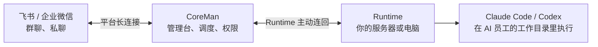
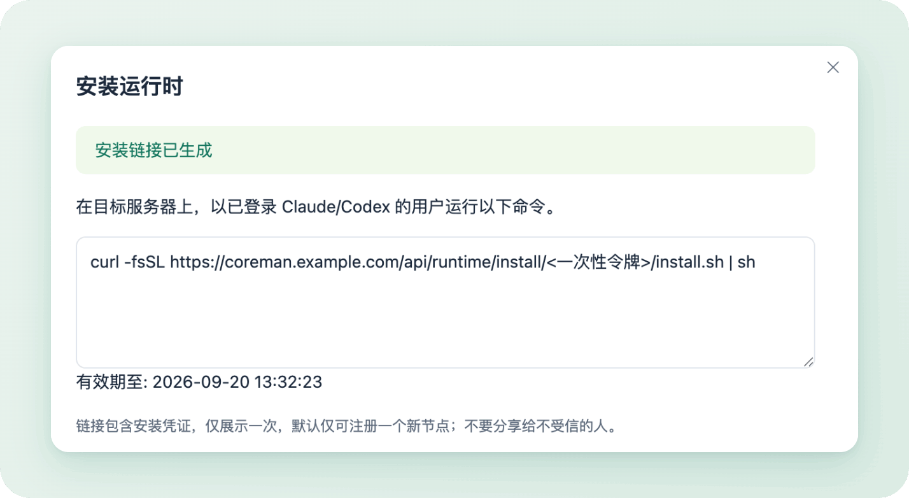
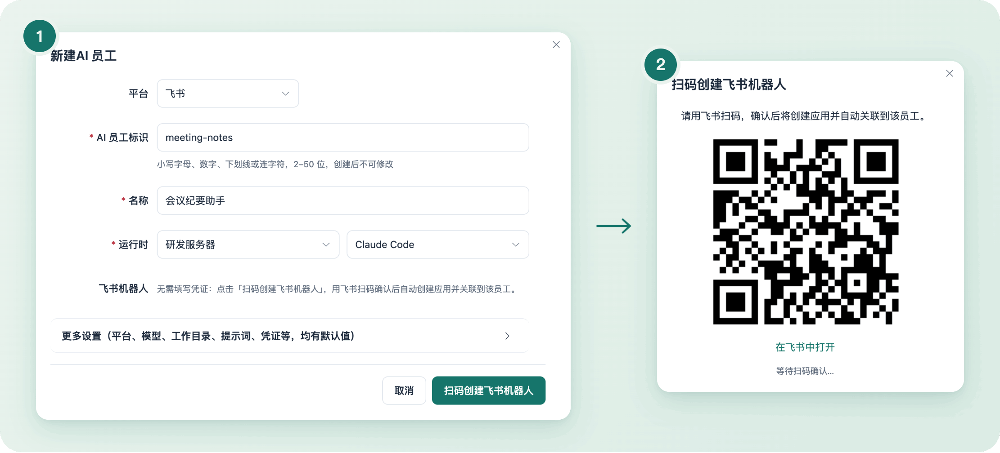
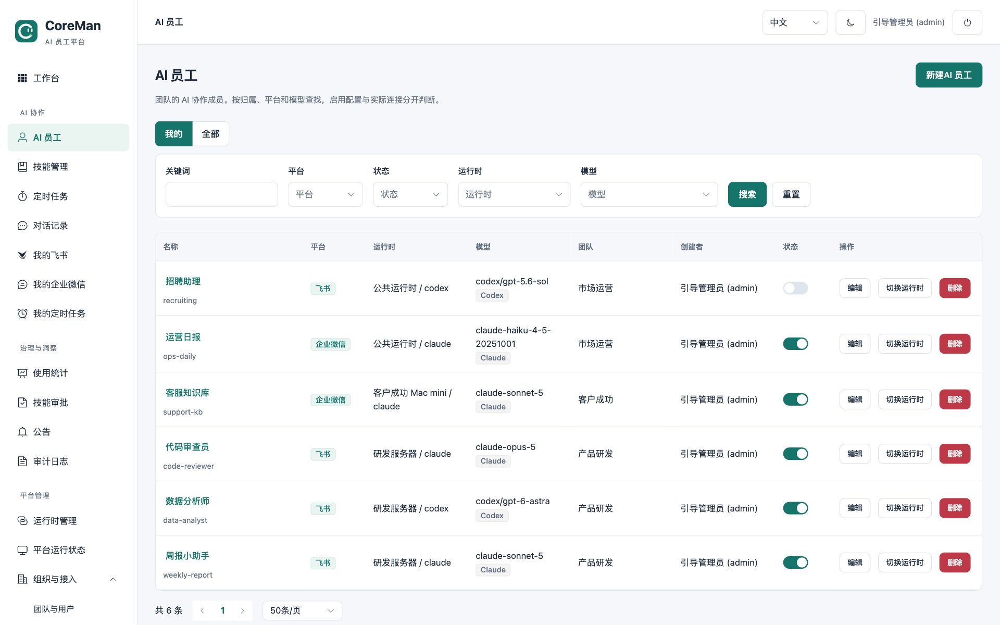
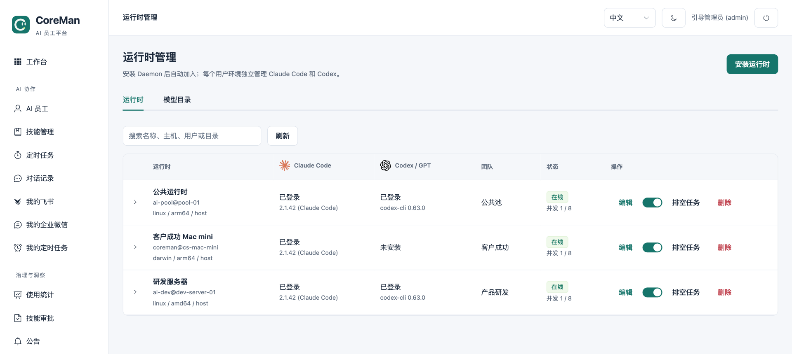

<p align="center"></p>

<p align="center">
  <a href="https://github.com/wxkingstar/CoreMan/actions/workflows/ci.yml"></a>
  <a href="https://github.com/wxkingstar/CoreMan/releases"></a>
  <a href="LICENSE"></a>
</p>

<p align="center">中文 · <a href="README.en.md">English</a></p>

# CoreMan

**把 Claude Code 和 Codex 变成团队在飞书、企业微信里随时能找的 AI 员工。**

在群里 @ 它，或者私聊它，它就在你们自己的机器上调用 Claude Code / Codex 干活，再把结果发回聊天。管理员在一个后台里管理所有 AI 员工：用什么模型、跑在哪台机器、装了哪些技能、谁可以使用。

- **扫码就有机器人**：新建 AI 员工时用飞书或企业微信扫一下，机器人自动创建好，不用去开放平台手动配应用。聊天走平台长连接，不需要公网 IP 或回调域名。
- **在你自己的环境里执行**：CoreMan 自托管；AI 在你指定的机器上、以指定的系统用户运行，工作文件留在那台机器上。
- **为团队设计**：团队与角色、技能审批、定时任务、对话记录、用量统计、审计日志开箱即有。

> [!NOTE]
> CoreMan 不提供模型额度。请自行安装并登录 Claude Code 或 Codex，使用你自己的订阅或 API 账号。

## 它能做什么

- **在群里分担工作**：「@周报小助手 汇总本周群里讨论过的需求」。回复流式输出，可以折叠查看思考过程，支持图片、文件和引用消息。
- **做个人助理**：在私聊里发「连接飞书」或「连接企业微信」并选择授权范围后（企业微信需先在管理台「我的企业微信」扫码绑定一次），它可以读取你本人的消息、会议、文档、日程等资料来回答问题。这些能力只在你和它的私聊里使用。
- **按时自动干活**：私聊里说「每个工作日 9 点总结我的飞书未读消息」，点一下确认就建好定时任务。管理员也可以配置定时任务，把结果推送到群聊、私聊或邮件。
- **拿不准时找人**：通过人工求助把问题转给指定同事，同事回复后 AI 接着处理。
- **统一管理能力**：从 Git 插件市场同步技能，审批后装给 AI 员工；AI 调用内部业务系统时，带的是提问人本人的身份。

## 工作原理



- **CoreMan** 是用 Docker Compose 部署的管理端，负责收发聊天消息、排队调度、权限和数据存储。
- **Runtime** 是装在 Linux 或 macOS 用户环境里的守护进程。它主动连回 CoreMan，所在机器不需要开放入站端口；一个 Runtime 同时提供这个用户已登录的 Claude Code 和 Codex。
- **AI 员工** 由一个飞书或企业微信机器人、一个 Runtime、模型、工作目录、提示词和技能组成。

各组件的关系见 [架构与服务拓扑](docs/architecture.md#service-topology)，术语见 [术语表](docs/glossary.md)。

## 快速开始

下面的流程在一台电脑上就能跑通。

**准备：**

- 一台装有 Git、Python 3 和 Docker（含 Compose v2）的电脑或服务器，用来运行 CoreMan。
- 一个装好并登录了 Claude Code 或 Codex 的 Linux / macOS 用户环境，用来运行 Runtime。试用时可以就是上面这台电脑。
- 一个飞书或企业微信账号，用来扫码创建机器人。

### 1. 启动 CoreMan

```bash
git clone https://github.com/wxkingstar/CoreMan.git
cd CoreMan
cp .env.example .env
./deploy/coreman build
./deploy/coreman up
```

首次构建要下载容器镜像和 Python、Node.js、Go 依赖，耗时取决于网络。`up` 会自动生成加密密钥、数据库密码和管理员密码，并写回 `.env`，请妥善备份这个文件。

启动后打开 <http://localhost/>，用户名为 `admin`，密码用下面的命令查看：

```bash
grep BOOTSTRAP_ADMIN_PASSWORD .env
```

80 端口被占用时，先在 `.env` 里设置 `CADDY_HTTP_PORT=8080`、`CADDY_HTTPS_PORT=8443`、`PUBLIC_BASE_URL=http://localhost:8080`，再执行 `./deploy/coreman up`。

### 2. 接入 Runtime

在「运行时管理」点「安装运行时」，填写项目主目录（AI 员工的工作目录都会建在它下面），生成安装命令。到已经登录 Claude Code 或 Codex 的用户环境里执行这条命令，安装完成后列表里就会出现这台机器，并显示 Claude Code 和 Codex 的登录状态。

<p align="center"></p>

Linux 需要用户级 systemd，Debian / Ubuntu 还要先安装 `python3-venv`，完整要求见 [Runtime 安装说明](runtime_daemon/README.md)。

### 3. 创建 AI 员工

在「AI 员工」点「新建 AI 员工」，填写标识和名称，选择刚才的运行时，点「扫码创建飞书机器人」，再用飞书扫码确认。飞书机器人和 AI 员工会一起创建好（国际版 Lark 暂不支持扫码创建）。

<p align="center"></p>

用企业微信时，把平台切换为企业微信，点「扫码创建企业微信机器人」；扫码建出的机器人默认仅个人使用，要让同事也能发消息，需在电脑端企业微信里把它的使用模式改为「多人使用」。已有机器人也可以在「更多设置」里手动填写凭证。平台侧的准备和限制见 [飞书接入](docs/feishu.md) 与 [企业微信接入](docs/wecom.md)。

### 4. 在聊天里使用

在飞书或企业微信里找到这个机器人，私聊它，或者把它拉进群并 @ 它。每轮对话都会出现在「对话记录」里，连接和任务队列的状态在「平台运行状态」里查看。没有收到回复时，先看这两个页面，再对照上面的接入文档排查。

## 管理台

所有 AI 员工集中在一个列表里，按平台、运行时、模型和团队查找：



每台机器上的 Claude Code、Codex 是否登录、是否在线，都能在运行时管理里看到：



管理台支持中文、日文和英文。

## 功能一览

- **聊天接入**：飞书、企业微信长连接收发，流式回复与思考过程，图片、文件、引用消息，交互问答卡片，飞书斜杠指令（`/new`、`/stop` 等）。
- **AI 员工**：扫码创建机器人，提示词、模型、工作目录、协作者、使用白名单与团队归属，切换运行时并迁移工作区与记忆；飞书应用的权限、菜单、可用范围和发布也能在管理台里完成。
- **个人授权**：成员在私聊里连接飞书或企业微信，按档位授权读取和办理本人事务（企业微信先在「我的企业微信」扫码绑定一次）；只在本人私聊和本人的定时任务中使用，相关对话只有本人能查看。
- **任务与协作**：定时任务（投递到私聊、群聊、邮件或企业微信群机器人）、成员自建的 AI 定时任务、人工求助、会话管理、飞书 AI 员工之间的协作。
- **技能与业务系统**：技能目录与安装审批、环境预设、记忆同步；按提问人签发短期令牌访问内部业务系统。
- **团队与治理**：团队、角色、通讯录同步与平台登录、加密凭证、用量与成本统计、AI 员工体检、审计日志、公告。
- **自托管运维**：Docker Compose 部署、数据库迁移、网关排空升级与回滚、可选 S3 附件存储、Prometheus 指标与告警。

## 部署到生产环境

- **域名与 HTTPS**：在 `.env` 中把 `CADDY_SITE_ADDRESS` 设为你的域名（例如 `coreman.example.com`），`PUBLIC_BASE_URL` 设为对应的 `https://` 地址，Caddy 会自动申请证书。浏览器和所有 Runtime 都需要能访问这个地址。
- **平台登录与通讯录**：在「团队与用户」建立团队，在「平台应用」配置通讯录同步和登录。确认平台登录可用后，在「设置」中关闭引导管理员登录。
- **执行边界**：AI CLI 以 Runtime 所属系统用户的权限运行。请为 Runtime 准备独立、最小权限的系统用户，按需隔离文件和网络；提示词约束不能代替操作系统隔离。信任模型见 [安全说明](SECURITY.md)。
- **升级与备份**：用 `./deploy/coreman build` 构建新版本，再用 `./deploy/coreman upgrade all <标签>` 滚动升级，详见 [运行维护](docs/operations.md)。定期备份 `.env` 和数据库；`MASTER_KEY` 丢失后，库里加密保存的凭证无法解密。

项目仍处于早期阶段（当前发布版本 0.2.0），`main` 分支持续加入新功能，变更见 [CHANGELOG](CHANGELOG.md)。

## 文档

- 概念与结构：[术语表](docs/glossary.md) · [架构与服务拓扑](docs/architecture.md#service-topology)
- 接入与能力：[飞书](docs/feishu.md) · [企业微信](docs/wecom.md) · [技能与审批](docs/skills-management.md) · [记忆](docs/memories.md) · [定时任务](docs/cron-jobs.md) · [人工求助](docs/escalations.md) · [飞书 AI 员工协作](docs/features/feishu-bot-collaboration.md)
- 运维与集成：[运行维护](docs/operations.md) · [基础设施 API](docs/infrastructure-api.md) · [对象存储](docs/object-storage.md) · [统计与体检](docs/statistics-and-health.md) · [IM 回复时限](docs/im-reply-lifecycle.md)
- 运行环境：[Runtime Daemon](runtime_daemon/README.md) · [Linux 环境手册](docs/environment-creation/README.md)
- 参与开发：[本地开发与测试](docs/development.md)

## 参与贡献与安全

欢迎提交 Issue 和 Pull Request。提 Issue 时请附上版本、复现步骤和脱敏后的日志；提 PR 时说明改动目的和验证方式，本地开发与测试方法见 [本地开发与测试](docs/development.md)。请不要上传真实的 `.env`、平台凭据、安装令牌、聊天记录、通讯录、数据库备份或内部系统截图。

发现凭据泄露或可利用的漏洞时，请通过仓库的私密漏洞报告渠道联系维护者（启用后可用），不要在公开 Issue 中披露细节。更多约定见 [安全说明](SECURITY.md)。

## 许可证

本项目采用 [MIT License](LICENSE)。第三方代码和图标保留各自的版权与许可证，见 [第三方声明](THIRD_PARTY_NOTICES.md)。
