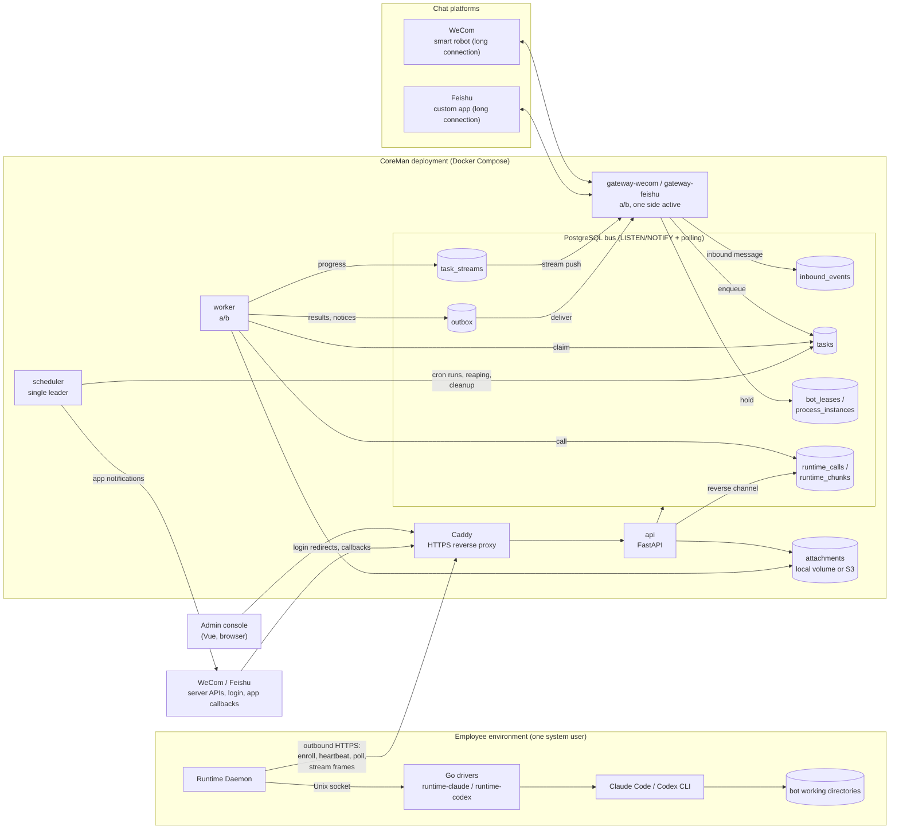

# Architecture

CoreMan separates chat delivery, task execution and administration into independently running services.

- **Management API**: FastAPI serves the Vue interface and authenticated administration endpoints.
- **PostgreSQL**: stores configuration, leases, task state, event streams and a durable outbox. LISTEN/NOTIFY wakes consumers, with polling for recovery.
- **Gateways**: maintain platform connections, normalize inbound events and deliver queued responses.
- **Workers**: resolve the current requester, construct prompts, call an assigned runtime and persist results.
- **Scheduler**: creates scheduled work, reclaims interrupted tasks and coordinates maintenance.
- **Runtime Daemon**: connects outward to the management service and supervises local CLI drivers. The daemon user and host permissions define the execution boundary.
- **Storage**: attachments use a shared local volume or an explicitly configured S3 backend.

The services coordinate through persisted state rather than an additional message broker. Multiple workers and gateways use database claims and leases to avoid concurrent ownership.

## Service topology

Terms used below are defined in the [glossary](glossary.md).

A chat message travels as follows: the active gateway for the bot (the lease holder) stores the inbound event and a task. A worker claims the task, builds the request and writes a runtime call. The runtime node that owns the bot's instance picks up the call through its outbound poll, runs the CLI in the bot's working directory and streams frames back. The worker writes progress to `task_streams`, the gateway pushes it to the chat platform, and anything that must be sent later goes through the outbox.

## Configuration layers

Configuration comes from five layers. Each layer owns its own keys, so there is no general rule where a later layer overrides an earlier one. Where layers do interact, the rules are listed under [Precedence](#precedence).

| Layer | Stored in | Example keys | Changed through | Takes effect |
|---|---|---|---|---|
| 1. Infrastructure | `.env` or the process environment (`coreman/core/config.py`) | `DATABASE_URL`, `MASTER_KEY`, `PUBLIC_BASE_URL`, `OBJECT_STORAGE` | Edit `.env` on the deployment host | After the services restart |
| 2. Platform settings | `settings` table (keys and defaults in `coreman/core/settings_schema.py`) | `session_ttl_hours`, `max_concurrent_tasks` / `fast_lane_slots`, `prompt_*` | Settings page (`PUT /api/admin/settings`, platform administrators) | Saving publishes `config_changed`. Processes also refresh their 60-second cache |
| 3. Bot | `bots` row | `model`, `relay_server_id`, `verbosity_level` / `effort_level`, `sse_timeout_seconds`, `env_vars` | Bot pages (bot administrators) | Next task. Gateways reload on `config_changed` |
| 4. Runtime instance | `relay_servers` row, plus the global `model_catalog` | `model_provider`, `supported_models_mode` / `supported_models`, `visibility` | Runtime and model catalog pages (AI committee, platform administrators) | Next bot edit or task |
| 5. Runtime node | `~/.local/share/coreman-runtime/config.json` (mode 0600) and the runtime user's service environment | `max_concurrent` (reported in heartbeats and shown on the runtime page), `proxy` / `control_proxy`, `workspace_root`, `git_hosts` (Git hosts that workspace pull, push, backup and pull requests may reach; skill installs follow the catalog and are not limited by it), `ca_file` for the TLS trust of the daemon itself, and `SSL_CERT_FILE` / `NODE_EXTRA_CA_CERTS` in the service environment for the CLIs and npm | Install link options set the first values, including an optional private CA. After that, edit the file or environment on the node | After the daemon restarts |

Missing keys in layer 2 fall back to `SETTING_DEFAULTS`. The `settings` table also holds `alert_channels` and `notification_smtp`, which are edited on their own pages. Secrets stay in layer 1 or in encrypted `*_enc` columns. A node's token exists only in its local `config.json`.

### Precedence

- **Defaults and bots.** `default_verbosity_level`, `default_effort_level` and `default_model` only fill in the new-bot form. Once a bot is saved, its row wins. Changing a default never rewrites existing bots.
- **Default model.** `default_model` is derived, not stored. It is the default of the `claude` provider in `model_catalog`, or the `codex` default if `claude` has none. Retired rows are skipped. The settings API rejects writes to it. Change the default in the model catalog instead.
- **Models.** A bot's `model` must belong to its runtime instance's effective model set. `inherit` means every non-retired catalog model of the provider. `restricted` means `supported_models` intersected with the catalog.
- **Visibility.** An instance with `visibility = admins` is offered only to the AI committee and platform administrators when a runtime is chosen for a bot.
- **Concurrency.** `max_concurrent_tasks` (layer 2) caps the tasks workers run across the platform and reserves `fast_lane_slots` of them. A node's `max_concurrent` (layer 5, default 10, 1-32 at install time) caps the calls that node accepts. The two limits are independent, so a task admitted by the worker gate still waits in the node queue when that node is full. A run waits at most 120 seconds for the node to take it. After that it fails as "runtime busy" and the queued call is withdrawn, so the node never starts work that nobody is waiting for. Probes such as health checks do not queue and fail after their connect timeout.
- **Timeouts.** `bots.sse_timeout_seconds` bounds a single run. A call through a runtime node expires after the queue limit plus that timeout plus five minutes, so runs up to the 12-hour maximum are not cut short. IM delivery deadlines are fixed platform policy. `bots.agent_timeout_seconds` is no longer read and will be removed in the next release.
- **Deprecated columns.** `bots.custom_command_modules` is no longer read or written and will be removed in the next release.
- **System grant history.** The `system_grant_audit` table is no longer written or read. Grant changes are recorded in `audit_logs` (`bot.system_grants`, `system.update`). The table will be removed in the next release.

Secrets remain in deployment configuration or encrypted database fields. Do not expose database, monitoring or driver ports as public application endpoints. Deploy independent runtime user environments when workloads require separation.

For installation and upgrades, see [operations](operations.md) and [Runtime Daemon](../runtime_daemon/README.md).
